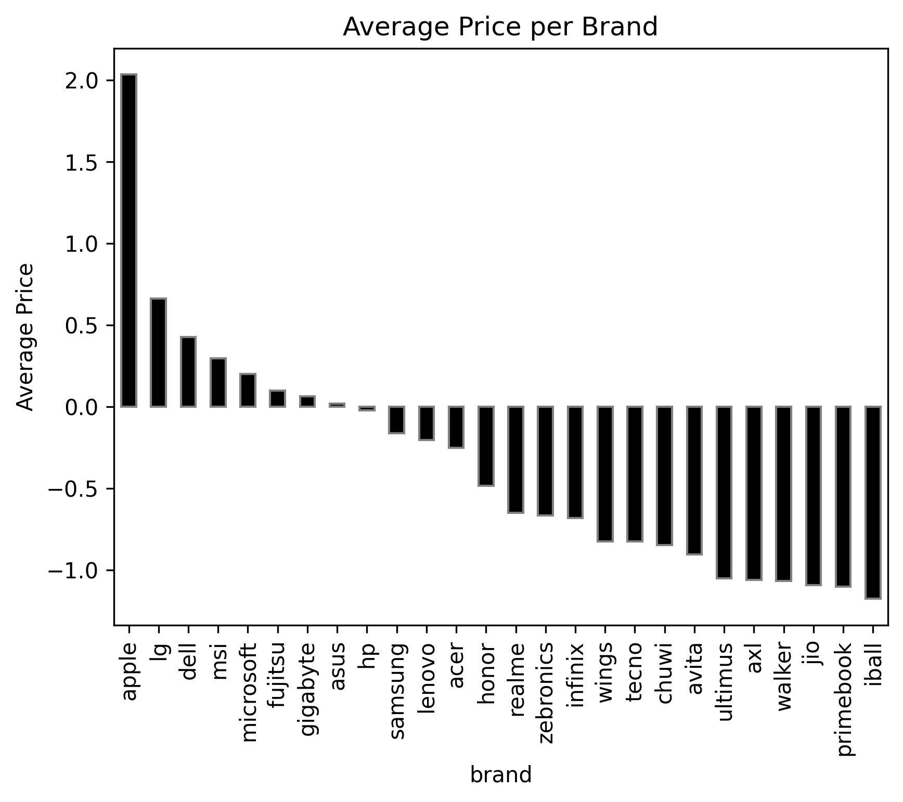
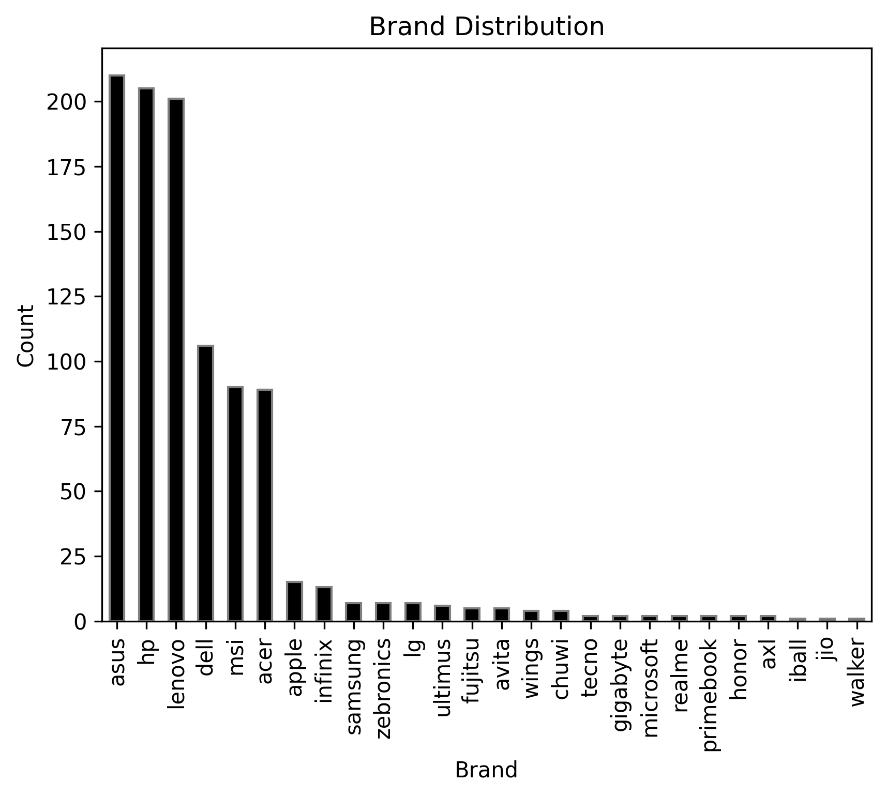
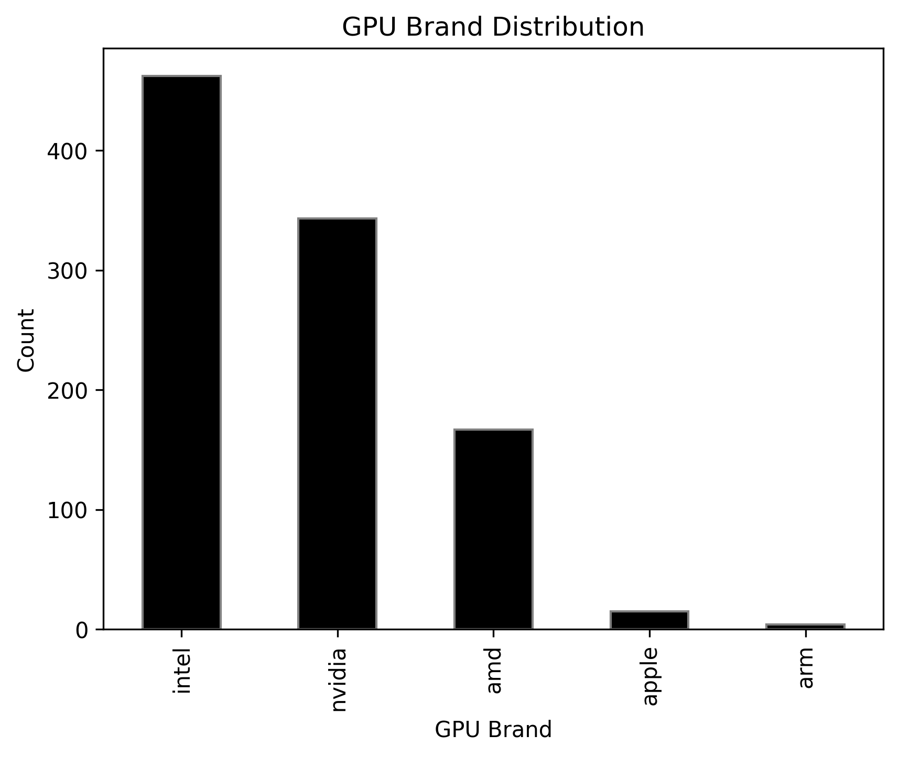
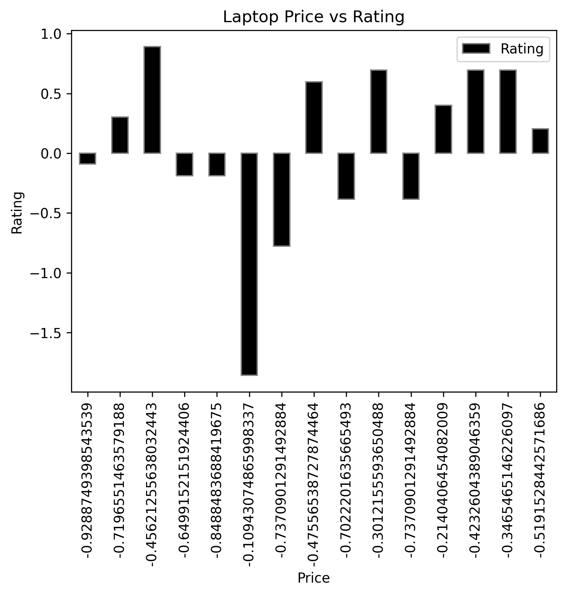
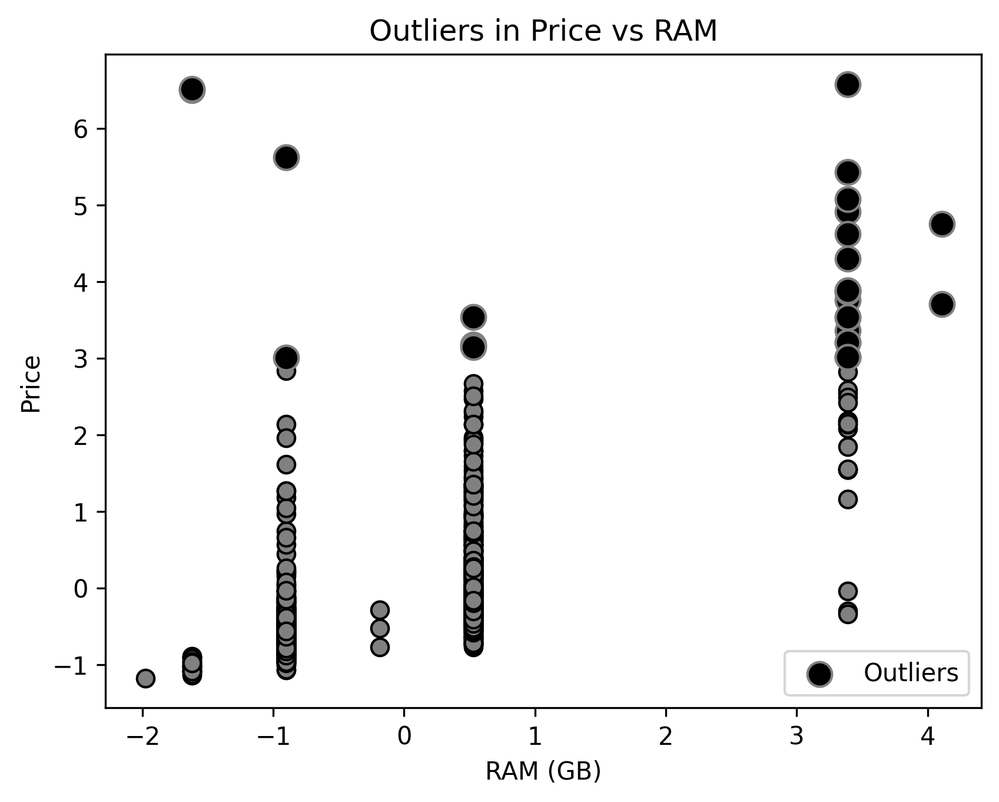
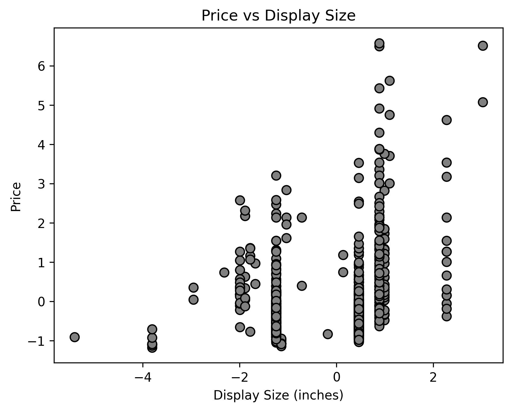
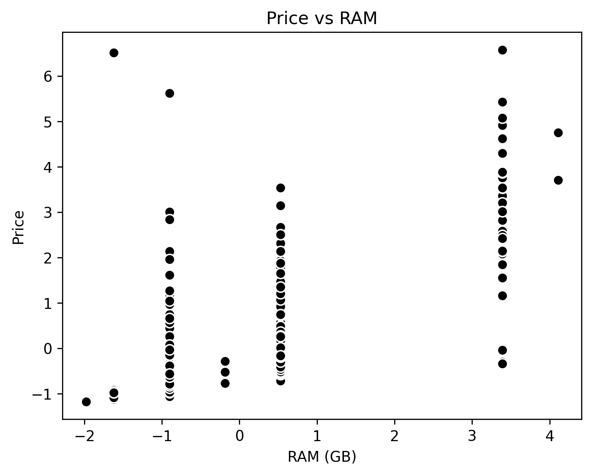
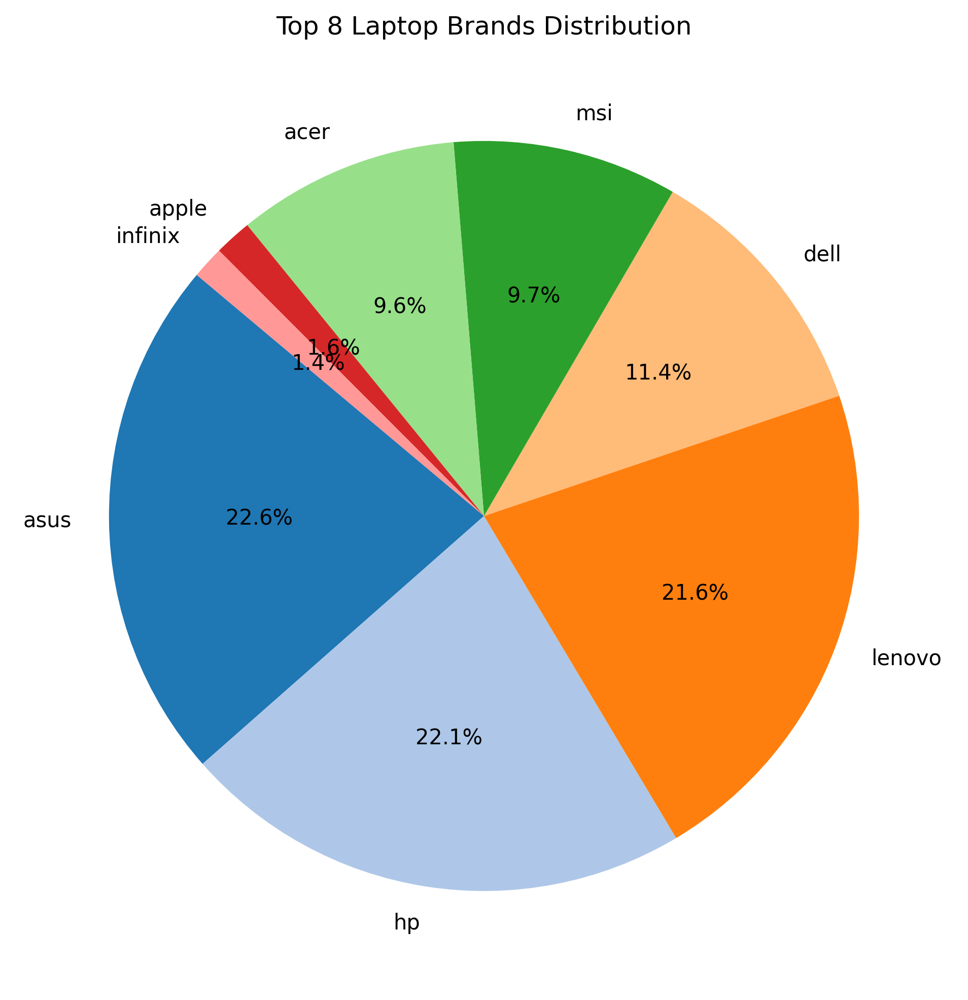
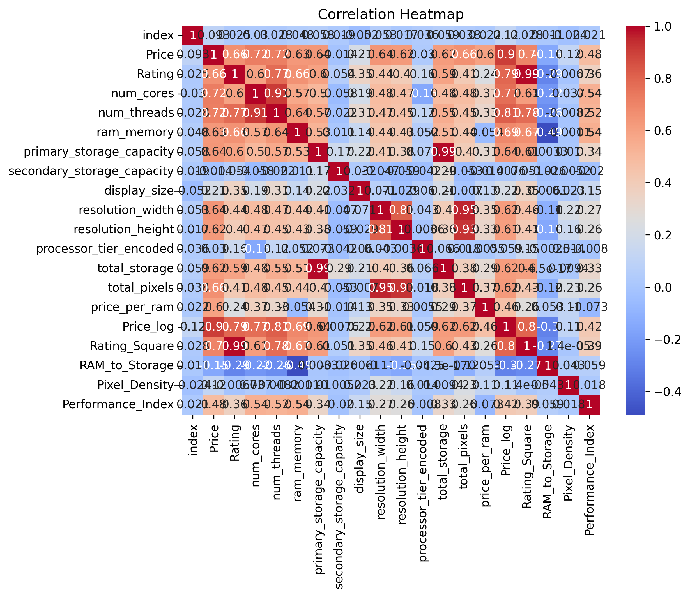

Laptop Dataset EDA and Feature Engineering

Project Overview
This project performs **Exploratory Data Analysis (EDA)** and **Feature Engineering** on a laptop dataset containing information like brand, price, RAM, storage, processor, GPU, display, and more. The goal is to understand the data, detect outliers, visualize distributions, and create meaningful features for future Machine Learning tasks.

Dataset
The dataset includes the following columns:
- `brand`, `Model`, `Price`, `Rating`
- `processor_brand`, `processor_tier`, `num_cores`, `num_threads`
- `ram_memory`
- `primary_storage_type`, `primary_storage_capacity`
- `secondary_storage_type`, `secondary_storage_capacity`
- `gpu_brand`, `gpu_type`
- `is_touch_screen`
- `display_size`, `resolution_width`, `resolution_height`
- `OS`, `year_of_warranty`

---

Exploratory Data Analysis (EDA)

## 📈 Visual Analysis

### 🔹 Average Price per Brand
Shows the average laptop price for each brand.  
Useful for comparing **brand pricing trends**.

---

### 🔹 Average Price of Each Brand (Alternate View)
Displays another perspective on **average price distribution** across brands.  

---

### 🔹 Brand Distribution
Pie chart / count plot of **brands available** in the dataset.  

---

### 🔹 GPU Brand Count
Shows how many laptops use each **GPU brand**.  
Helps identify GPU popularity trends.  

---

### 🔹 Price vs Rating
Visualizes the relationship between **price** and **rating**.  
Helps in understanding if expensive laptops have better ratings.  

---

### 🔹 Outlier Representation (Boxplot)
Highlights **price outliers** and overall distribution.  

---

### 🔹 Price vs Display Size – Outliers
Shows how display size influences price and where outliers occur.  

---

### 🔹 Price vs RAM – Outliers
Examines laptops where **price vs RAM** combinations behave abnormally.  

---

### 🔹 Top 8 Brands
Pie chart representation of the **top 8 laptop brands** in the dataset.  

---

### 🔹 Correlation Heatmap
Displays the correlation between all numeric variables.  
Used for **feature selection** and detecting multicollinearity.  

Feature Engineering

- Total Storage: primary_storage_capacity + secondary_storage_capacity  
- Total Pixels: resolution_width × resolution_height
- Price per RAM: Price / ram_memory  
- Binned Price: Price discretized into categories (Low, Medium, High, Very High)

Sample Table
| Price | Total Storage | Total Pixels | Price per RAM | Price Bin |
|-------|---------------|--------------|---------------|-----------|
| 50000 | 512           | 2073600      | 12500         | Low       |
| 75000 | 1024          | 2073600      | 9375          | Medium    |

Feature Selection

- Selected numeric features strongly correlated with Price:  
    ram_memory, total_storage, display_size 
- Helps reduce noise and improve **machine learning model performance**.
