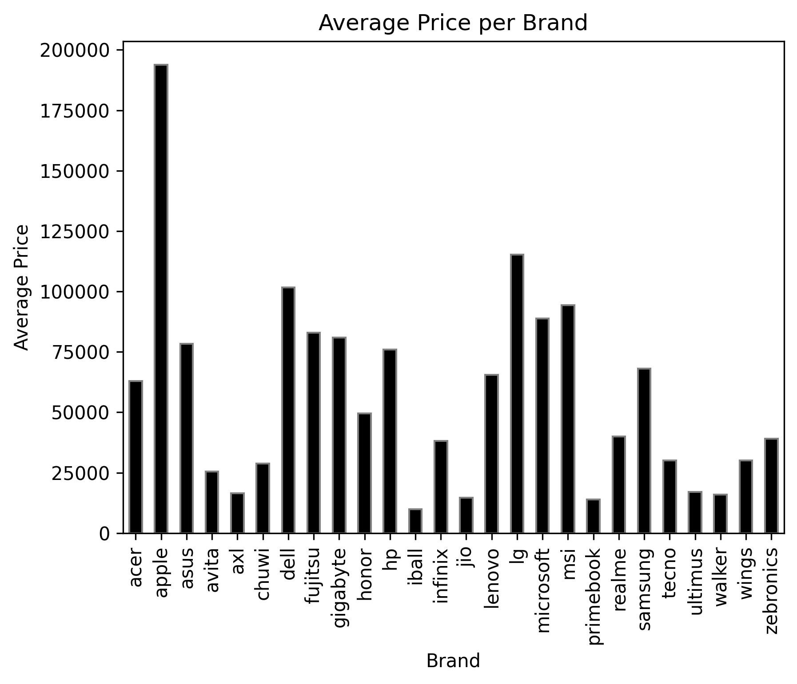

Laptop Dataset EDA and Feature Engineering

Project Overview
This project performs **Exploratory Data Analysis (EDA)** and **Feature Engineering** on a laptop dataset containing information like brand, price, RAM, storage, processor, GPU, display, and more. The goal is to understand the data, detect outliers, visualize distributions, and create meaningful features for future Machine Learning tasks.

Dataset
The dataset includes the following columns:
- `brand`, `Model`, `Price`, `Rating`
- `processor_brand`, `processor_tier`, `num_cores`, `num_threads`
- `ram_memory`
- `primary_storage_type`, `primary_storage_capacity`
- `secondary_storage_type`, `secondary_storage_capacity`
- `gpu_brand`, `gpu_type`
- `is_touch_screen`
- `display_size`, `resolution_width`, `resolution_height`
- `OS`, `year_of_warranty`

---

Exploratory Data Analysis (EDA)

### 🔹 Average Price of Each Brand (Alternate View)
Displays another perspective on **average price distribution** across brands.  

Feature Engineering

- Total Storage: primary_storage_capacity + secondary_storage_capacity  
- Total Pixels: resolution_width × resolution_height
- Price per RAM: Price / ram_memory  
- Binned Price: Price discretized into categories (Low, Medium, High, Very High)

Sample Table
| Price | Total Storage | Total Pixels | Price per RAM | Price Bin |
|-------|---------------|--------------|---------------|-----------|
| 50000 | 512           | 2073600      | 12500         | Low       |
| 75000 | 1024          | 2073600      | 9375          | Medium    |

Feature Selection

- Selected numeric features strongly correlated with Price:  
    ram_memory, total_storage, display_size 
- Helps reduce noise and improve **machine learning model performance**.
